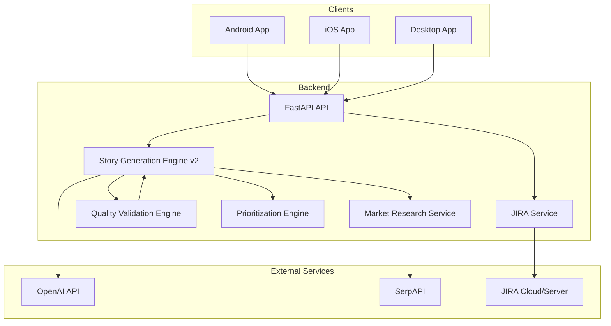
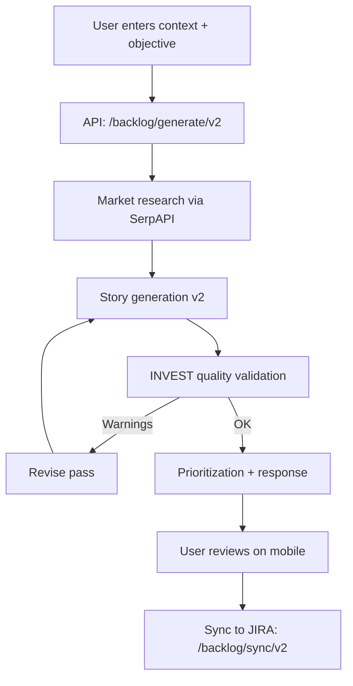
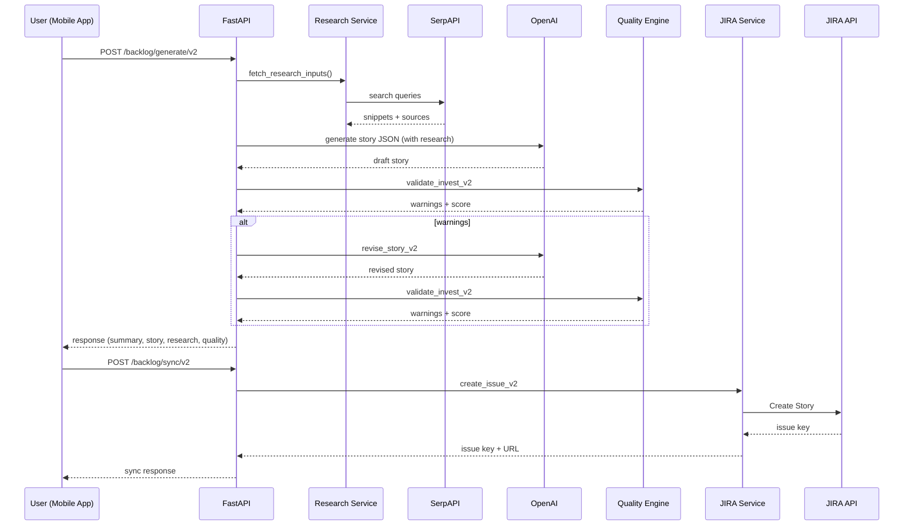

# Architecture: BacklogAI

> Detailed system design, core modules, and runtime flows.

## 1) System Overview

BacklogAI is a Kotlin Multiplatform client connected to a FastAPI backend that orchestrates research, story generation, quality validation, and JIRA sync.

Key notes:
- The v2 flow starts with context + objective, then runs research, generation, and quality checks.
- SerpAPI is rate-limited and cached to respect the free tier and reduce costs.
- If OpenAI is unavailable, a deterministic fallback uses SerpAPI summaries to populate research fields.

---

## 2) Core Modules

| Module | Purpose | Key Responsibilities |
| --- | --- | --- |
| Input V2 | Context intake | Accepts context, objective, and optional signals (persona, segment, constraints, metrics, competitors). |
| Market Research | External signal discovery | Queries SerpAPI, summarizes trends/competitors, caches results, enforces rate limits. |
| Story Generation v2 | AI drafting | Produces INVEST-ready story, Gherkin AC, tasks, NFRs, metrics, risks, and rollout plan. |
| Quality Validation | INVEST checks | Scores and warns; triggers revision pass when quality is low. |
| Prioritization | Scoring | Computes priority score and MoSCoW classification. |
| JIRA Integration | Sync | Maps summary/description to JIRA fields and creates issues. |
| KMM UI | Cross-platform app | Guides input, previews research and story, syncs to JIRA. |

---

## 3) Runtime Flow (v2)

---

## 4) Sequence Diagram (Generate + Sync)

---

## 5) Technology Stack

### Backend
- Python 3.11+ with FastAPI
- OpenAI API for story generation
- SerpAPI for market research
- Jira REST API for issue creation

### Frontend (Kotlin Multiplatform)
- Compose Multiplatform UI
- Ktor Client for networking
- Android + iOS host apps

### Tooling
- Gradle for builds
- Docker Compose for local services
