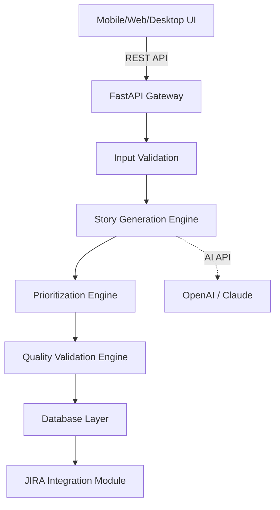

# Architecture & Technology Stack: BackLogAI

## 1. System Overview

BackLogAI is designed as a modular, containerized application with three core layers:

1.  **Frontend (UI/CLI)**: The user interaction layer.
2.  **Backend (API/Logic)**: The processing and coordination layer.
3.  **Data & Integration**: Persistence and external service connections.

## 2. Core Modules

### A. Input Module
*   **Purpose:** Accepts structured data for the **Five Key Pillars**.
*   **Functionality:** Validates JSON schemas, sanitizes text inputs, and normalizes priority scores (1-10 scale).

### B. Story Generation Engine
*   **Purpose:** Creates structured user stories using LLMs.
*   **Process:**
    1.  **Template Filling:** Populates common patterns (CRUD, Search) based on feature type.
    2.  **AI Contextualization:** Uses product personas and goals to generate nuanced stories.
    3.  **Decomposition:** Breaks large features (Epics) into smaller Stories and Tasks.

### C. Prioritization Engine
*   **Purpose:** Calculates definitive priority scores.
*   **Algorithms:**
    *   **RICE:** (Reach × Impact × Confidence) / Effort
    *   **WSJF:** Cost of Delay / Job Duration (Technical Reality)
    *   **MoSCoW:** Categorical sorting (Must/Should/Could/Won't) based on combined Pillar scores.

### D. Quality Validation Engine
*   **Purpose:** Ensures stories are actionable.
*   **Criteria (INVEST):**
    *   **I**ndependent
    *   **N**egotiable
    *   **V**aluable
    *   **E**stimable
    *   **S**mall
    *   **T**estable

### E. JIRA Integration Module
*   **Purpose:** Syncs the generated backlog to the real world.
*   **Capabilities:**
    *   Create Issue (Epic/Story/Task).
    *   Link Issues (Parent/Child).
    *   Update Status/Description.
    *   Two-way sync (status pull).

## 3. Technology Stack

### Backend Stack

*   **Language:** Python 3.11+
    *   **Reason:** Fast, modern syntax, excellent async support, rich ecosystem.
*   **Web Framework:** FastAPI
    *   **Reason:** High-performance async API with native OpenAPI/Swagger support, excellent dependency injection.
*   **Database:** PostgreSQL
    *   **Reason:** Reliable data integrity, complex queries, JSONB support for dynamic inputs.
*   **ORM:** Tortoise-ORM or SQLAlchemy (Async)
    *   **Reason:** Async database operations for non-blocking I/O.
*   **Authentication:** OAuth2 (Google/GitHub/Microsoft)
    *   **Libraries:** `authlib` or `fastapi-sso`
*   **AI Integration:** OpenAI API / Anthropic Claude API
    *   **Libraries:** Official SDKs (`openai`, `anthropic`)
*   **Testing:** 
    *   `pytest` (Unit/Integration testing)
    *   `httpx` (API testing)
*   **Containerization:** Docker & Docker Compose
    *   **Purpose:** Postgres + Backend containerization for consistent dev/prod environments.

### Frontend Stack (Kotlin Multiplatform)

*   **Framework:** Kotlin Multiplatform (KMP)
    *   **Reason:** Write business logic once, deploy to multiple platforms natively.
*   **UI Toolkit:** Compose Multiplatform
    *   **Reason:** Declarative UI (Jetpack Compose) across Android, iOS, Desktop, and Web (Wasm).
*   **Target Platforms:**
    *   **Mobile:** Android, iOS
    *   **Desktop:** macOS, Windows, Linux (JVM)
    *   **Web:** WASM
*   **Networking:** Ktor Client
    *   **Reason:** Async, multiplatform HTTP client.
*   **Serialization:** `kotlinx.serialization`
    *   **Reason:** Type-safe JSON parsing across all platforms.
*   **Architecture Pattern:** MVVM / MVI
    *   **Libraries:** `voyager` (navigation) or standard Compose ViewModels.

### DevOps & Tooling

*   **Version Control:** Git (Monorepo structure)
*   **CI/CD:** GitHub Actions
    *   **Workflows:** Build, Test, Lint, Deploy
*   **Code Quality:**
    *   **Python:** `ruff` (linter/formatter), `mypy` (type checking)
    *   **Kotlin:** `ktlint` (linter)
*   **JIRA Integration:** Atlassian Python API Wrapper (`atlassian-python-api`)

## 4. Data Schema (Conceptual)

### Project Context
*   `id`: UUID
*   `name`: String
*   `description`: Text
*   `pillars_config`: JSON (Weights for the 5 pillars)
*   `created_at`: Timestamp
*   `updated_at`: Timestamp

### Backlog Item
*   `id`: UUID
*   `project_id`: UUID (FK to Project)
*   `type`: Enum (Epic, Story, Task)
*   `title`: String
*   `description`: Text (As a... I want... So that...)
*   `acceptance_criteria`: List[String] (Given/When/Then)
*   `priority_score`: Float
*   `pillar_scores`: JSON
    *   `user_value`: Float (0-10)
    *   `commercial_impact`: Float (0-10)
    *   `strategic_horizon`: Float (0-10)
    *   `competitive_positioning`: Float (0-10)
    *   `technical_reality`: Float (0-10)
*   `jira_key`: String (e.g., PROJ-123)
*   `status`: Enum (Draft, Approved, Synced, InProgress, Done)
*   `created_at`: Timestamp
*   `updated_at`: Timestamp

### User
*   `id`: UUID
*   `email`: String (unique)
*   `oauth_provider`: Enum (Google, GitHub, Microsoft)
*   `oauth_id`: String
*   `created_at`: Timestamp
