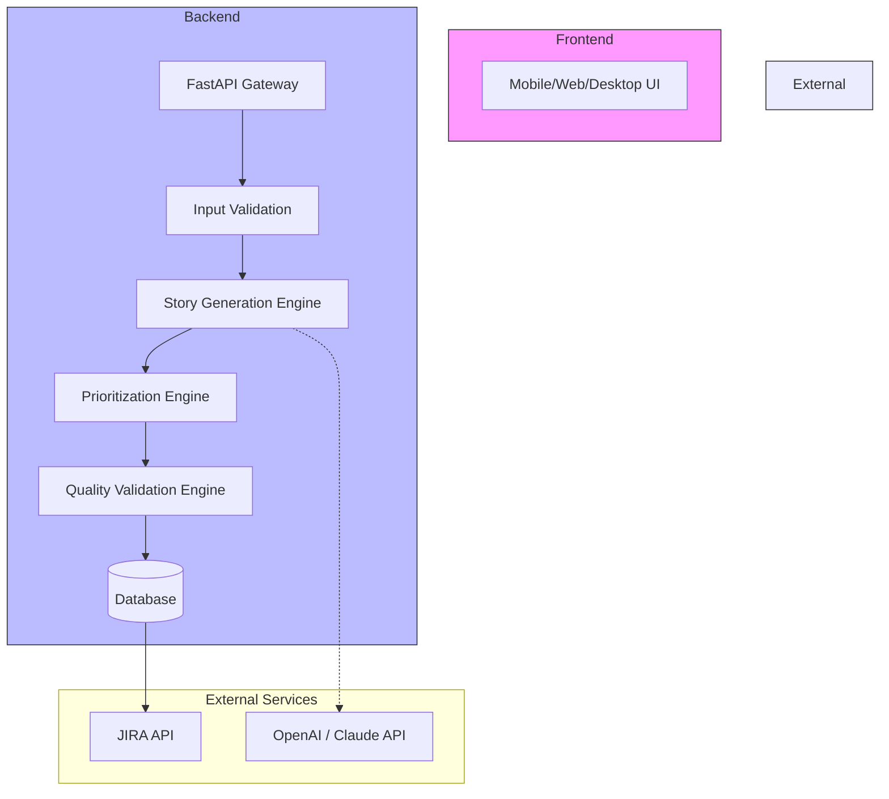
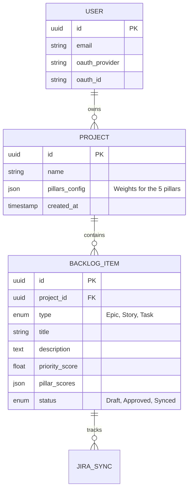

# 🏗️ Architecture: BackLogAI

> **Detailed System Design, Core Modules & Technology Stack**

## 1. System Overview

BackLogAI is designed as a modular, containerized application with three core layers:

1.  **Frontend (UI/CLI)**: The user interaction layer.
2.  **Backend (API/Logic)**: The processing and coordination layer.
3.  **Data & Integration**: Persistence and external service connections.

---

## 2. Core Modules

| Module | Purpose | Key Responsibilities |
| :--- | :--- | :--- |
| **A. Input Module** | 📥 Data Intake | Accepts structured data for the **Five Key Pillars** (User Value, Commercial Impact, etc.). Validates schemas and sanitizes inputs. |
| **B. Story Generation Engine** | 🤖 AI Processing | Uses LLMs to draft standard user stories (`As a... I want... So that...`) with `Given/When/Then` acceptance criteria. Decomposes Epics → Stories → Tasks. |
| **C. Prioritization Engine** | ⚖️ Scoring Logic | Calculates definitive priority scores using **RICE**, **WSJF**, and **MoSCoW** algorithms based on pillar weights. |
| **D. Quality Validation Engine** | ✅ Quality Control | Checks stories against **INVEST** criteria (Independent, Negotiable, Valuable, Estimable, Small, Testable). Returns warnings for vague stories. |
| **E. JIRA Integration Module** | 🔄 Sync & Action | Syncs the generated backlog to JIRA. Creates/updates issues, links parent/child items, and pulls status updates. |

---

## 3. Technology Stack

### Backend Stack

| Component | Technology | Why? |
| :--- | :--- | :--- |
| **Language** |  | Fast, modern syntax, excellent async support. |
| **Framework** |  | High-performance async API, native OpenAPI/Swagger. |
| **Database** |  | Reliable data integrity, JSONB support for dynamic inputs. |
| **ORM** | **Tortoise-ORM** / **SQLAlchemy** | Async database operations for non-blocking I/O. |
| **Auth** | **OAuth2** (Google/GitHub) | Standard secure authentication via `authlib` or `fastapi-sso`. |
| **AI** | **OpenAI** / **Anthropic** | Best-in-class LLMs for creative text generation. |

### Frontend Stack (Kotlin Multiplatform)

| Component | Technology | Why? |
| :--- | :--- | :--- |
| **Framework** |  | Write business logic once, run everywhere. |
| **UI Toolkit** | **Compose Multiplatform** | Declarative UI for Android, iOS, Desktop, and Web. |
| **Targets** | 📱 Android, iOS   💻 macOS, Windows, Linux   🌐 Web (Wasm) | Native performance on all major platforms. |
| **Networking** | **Ktor Client** | Async, multiplatform HTTP client. |
| **State** | **Voyager** / **MVI** | Robust state management and navigation. |

### DevOps & Tooling

*   **Version Control:** Git (Monorepo structure)
*   **CI/CD:** GitHub Actions (Build, Test, Lint, Deploy)
*   **Code Quality:** `ruff` (Python), `ktlint` (Kotlin)
*   **Containerization:** Docker & Docker Compose

---

## 4. Data Schema (Conceptual ER Diagram)

