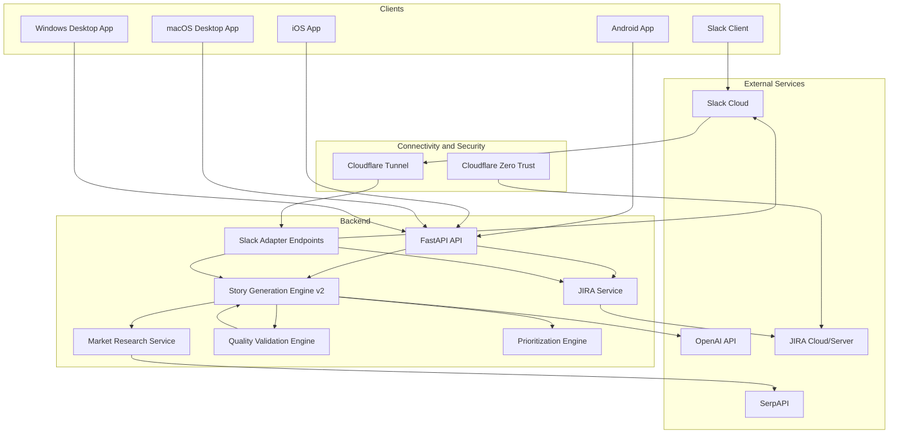
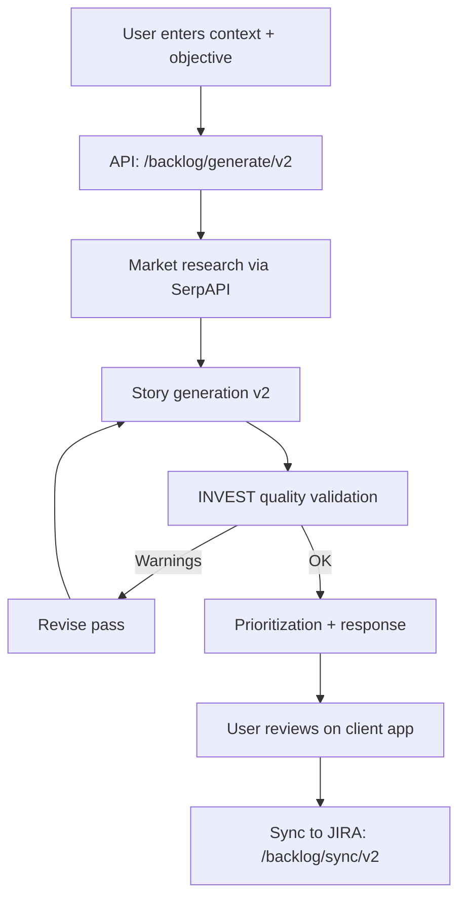
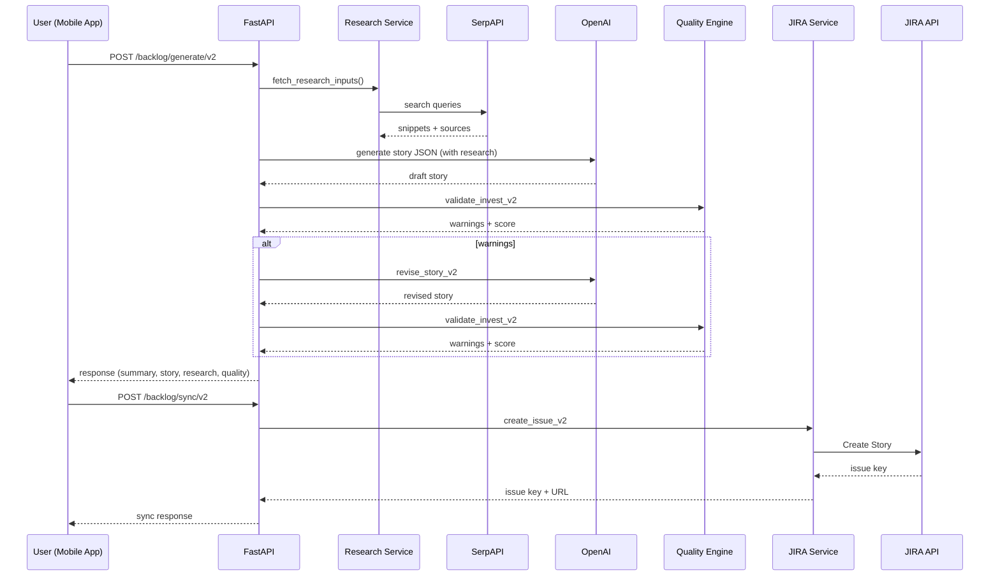
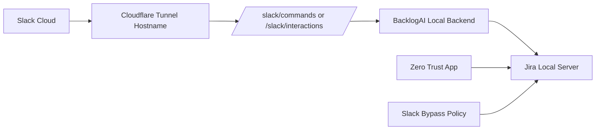
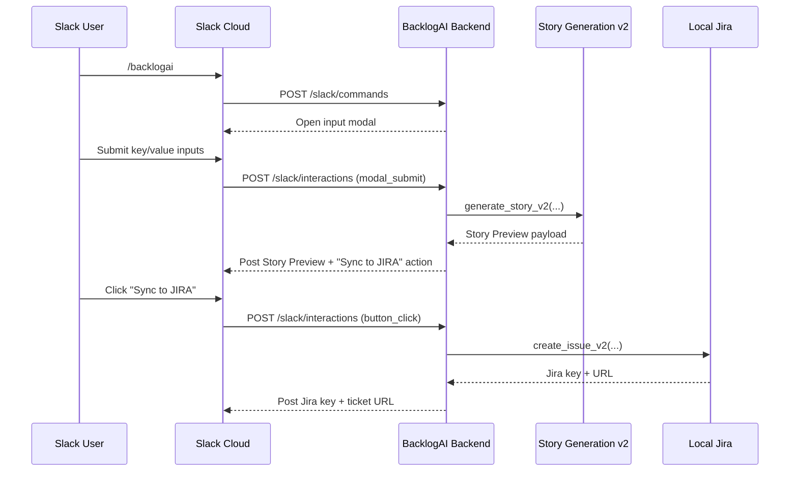

# Architecture: BacklogAI

> Detailed system design, core modules, and runtime flows.

## 1) System Overview

BacklogAI is a Kotlin Multiplatform client connected to a FastAPI backend that orchestrates research, story generation, quality validation, and JIRA sync.

Key notes:
- The v2 flow starts with context + objective, then runs research, generation, and quality checks.
- SerpAPI is rate-limited and cached to respect the free tier and reduce costs.
- If OpenAI is unavailable, a deterministic fallback uses SerpAPI summaries to populate research fields.
- Slack command handling uses an ack-first pattern to respond quickly and open modal work asynchronously.
- Jira URL normalization handles local runtime differences when `host.docker.internal` is not resolvable.
- Compose Desktop `desktopMain` powers both macOS and Windows clients from a shared code path.

---

## 2) Core Modules

| Module | Purpose | Key Responsibilities |
| --- | --- | --- |
| Input V2 | Context intake | Accepts context, objective, and optional signals (persona, segment, constraints, metrics, competitors). |
| Market Research | External signal discovery | Queries SerpAPI, summarizes trends/competitors, caches results, enforces rate limits. |
| Story Generation v2 | AI drafting | Produces INVEST-ready story, Gherkin AC, tasks, NFRs, metrics, risks, and rollout plan. |
| Quality Validation | INVEST checks | Scores and warns; triggers revision pass when quality is low. |
| Prioritization | Scoring | Computes priority score and MoSCoW classification. |
| JIRA Integration | Sync | Maps summary/description to JIRA fields and creates issues. |
| KMM UI | Cross-platform app | Guides input, previews research and story, syncs to JIRA. |

---

## 3) Runtime Flow (v2)

---

## 4) Sequence Diagram (Generate + Sync)

---

## 5) SLACK Integration

### Architectural Position
Slack is introduced as an additional client channel, equivalent to Android/iOS/macOS/Windows clients, routed through backend adapter endpoints.

### Design Goals
- Preserve existing Android/iOS/macOS flows while introducing Windows desktop support.
- Reuse existing v2 story generation and Jira sync services.
- Keep local Jira and local backend runtime unchanged.
- Enable secure remote Slack access through outbound tunnel only.

### Components Added
- Slack Adapter Endpoints:
  - `POST /slack/commands`
  - `POST /slack/interactions`
  - `POST /slack/events` (optional for later expansion)
  - Command endpoint returns immediate ACK to satisfy Slack timeout constraints.
- Slack Service Layer:
  - Signature validation
  - Modal parsing/mapping to v2 request model
  - Preview message and action block rendering
  - Slack Web API message posting
  - Block Kit composition for Story Preview and action buttons
- Slack Session State Store:
  - Tracks generated preview state and sync status
  - Prevents duplicate Jira ticket creation on repeated sync actions
- Jira Connectivity Reliability:
  - Normalizes Docker host aliases to `localhost` when backend runs directly on host runtime
  - Preserves Docker alias URL when hostname resolves in containerized runtime
- Secure Connectivity:
  - Cloudflare Tunnel for HTTPS callback routing to local services (`localhost` ingress)
  - Service mode support for roaming environments (Wi-Fi/hotspot switches)

### Secure Connectivity Flow

### Sequence Flow

### Security Model
- Slack signature verification on all Slack callbacks.
- Request timestamp validation for replay prevention.
- Tunnel exposure limited to required callback hostnames only.
- Cloudflare Access policy for Jira hostname (team email allow-list).
- Slack bypass policy for Jira path `/rest/slack/latest/*` with approved Slack IP ranges.
- Bypass policy priority above the main allow policy.

### Non-Impact Statement
No changes are required to existing client APIs for Android, iOS, and macOS desktop.
Windows desktop rollout and Slack integration are additive channels over the same backend API contracts.

---

## 6) Technology Stack

### Backend
- Python 3.11+ with FastAPI
- OpenAI API for story generation
- SerpAPI for market research
- Jira REST API for issue creation
- Slack Web API + interaction webhooks for Slack client flow

### Frontend (Kotlin Multiplatform)
- Compose Multiplatform UI
- Ktor Client for networking
- Android + iOS + Desktop host apps (macOS + Windows)

### Tooling
- Gradle for builds
- Docker Compose for local services
- Cloudflare Tunnel (`cloudflared`) for secure local-to-cloud webhook routing
- Slack Block Kit for rich interactive Slack UX
