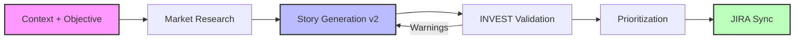

# 🚀 BacklogAI

> **AI Backlog Generator for Product Teams**  
> *Turn product context and objectives into INVEST-ready, JIRA-syncable user stories with AI, market research, and prioritization.*


---

## 🧐 What is BackLogAI?

Product Managers often struggle to balance competing demands from sales, engineering, and users. **BackLogAI** enforces a disciplined approach to backlog creation by combining context-driven inputs, market research, AI drafting, and INVEST validation. It ensures every story aligns with strategic business goals before it ever hits your JIRA board.

### 🔎 Keywords & Tags
`ai backlog management`, `jira story generator`, `product management ai`, `invest user stories`, `kotlin multiplatform`, `fastapi`, `market research automation`, `backlog prioritization`, `moscow prioritization`, `serpapi`

### The Golden Rule 🏆
Every backlog item generated by this system answers three critical questions:
1.  **Why now?** (Urgency) ⏰
2.  **Why this?** (Value) 💎
3.  **Why us?** (Strategic Fit) 🎯

---

## 🧠 The 5 Pillars Methodology

BackLogAI prioritizes features based on a weighted score across five dimensions:

| Pillar | Focus | Key Question |
| :--- | :--- | :--- |
| **1. User Value** | ❤️ Solving Pain Points | *"Will this feature actually be used and loved?"* |
| **2. Commercial Impact** | 💰 Revenue & Deals | *"Does this help close deals or reduce churn this quarter?"* |
| **3. Strategic Horizon** | 🔭 Future Demand | *"Are we building for the market of 2027, or reacting to 2026?"* |
| **4. Competitive Positioning** | ⚔️ Market Differentiation | *"Is this a catch-up feature or a differentiator?"* |
| **5. Technical Reality** | 🛠️ Feasibility & Debt | *"Is the technical 'price tag' worth the business value?"* |

---

## ⚙️ How It Works (v2)



1.  **Input:** User provides **context + objective** and optional signals (persona, segment, constraints, metrics, competitors).
2.  **Process:**
    *   **Research:** SerpAPI pulls relevant market and competitor signals (cached + rate-limited).
    *   **Generation:** AI drafts stories (`As a... I want... So that...`) with `Given/When/Then` acceptance criteria.
    *   **Validation:** INVEST checks produce warnings and a quality score, with an optional revision pass.
    *   **Scoring:** Computes priority score + MoSCoW classification.
3.  **Output:**
    *   JIRA-ready description with research summary, NFRs, metrics, risks, and rollout plan.
    *   Direct sync to JIRA.
    *   Cross-platform UI (Android + iOS implemented).

---

## 🔑 Configuration & Setup

To run BackLogAI effectively, you need to configure external services in your `.env` file.

### 1. OpenAI API (Story Generation)
*   **Sign up/Login:** [OpenAI Platform](https://platform.openai.com/)
*   **Create Key:** Go to [API Keys](https://platform.openai.com/api-keys) -> **Create new secret key**.
*   **Set Env:** `OPENAI_API_KEY=sk-...`
*   *Note: If you have issues logging in, try accessing [platform.openai.com](https://platform.openai.com) directly instead of auth subdomains.*

### 2. SerpAPI (Market Research)
*   **Sign up:** [SerpAPI](https://serpapi.com/)
*   **Free tier:** 250 searches/month
*   **Set Env:** `SERPAPI_API_KEY=...`

### 3. JIRA Integration (Sync)
*   **URL:** Your Atlassian domain (e.g., `https://your-domain.atlassian.net`).
*   **Username:** Your Atlassian email address.
*   **API Token:** Go to [Atlassian Security](https://id.atlassian.com/manage-profile/security/api-tokens) -> **Create API token**.
*   **Set Env:**
    ```properties
    JIRA_URL=https://your-domain.atlassian.net
    JIRA_USERNAME=your.email@example.com
    JIRA_API_TOKEN=your_api_token
    JIRA_PROJECT_KEY=KAN
    ```

---

## 🏗️ Architecture & Tech Stack

See [ARCHITECTURE.md](./ARCHITECTURE.md) for detailed system design.

| Layer | Stack |
| --- | --- |
| Backend API | Python 3.11+, FastAPI, Uvicorn |
| AI & Research | OpenAI API, SerpAPI (market search) |
| Backlog Logic | INVEST quality checks, MoSCoW prioritization, story decomposition |
| Integrations | Jira REST API, SMTP-compatible notification workflow |
| Client Apps | Kotlin Multiplatform + Compose (Android, iOS, macOS Desktop) |
| Build & Delivery | Gradle, Docker, GitHub |

## 🗺️ Roadmap

See [IMPLEMENTATION_PLAN.md](./IMPLEMENTATION_PLAN.md) for the phased development plan.

---

## 📄 License

This project is licensed under the MIT License - see the [LICENSE](LICENSE) file for details.

## SLACK Integration

### Overview
BacklogAI can be used from Slack as an additional client channel alongside Android, iOS, and macOS desktop.
This integration is additive and does not replace or alter existing clients.

### Important
- This integration is **not MCP-based**.
- Slack is cloud-hosted; no local Slack server is required.
- Existing local services on this machine (BacklogAI backend, Jira, Docker services) remain **as-is**.
- Slack callbacks reach local services through a secure outbound tunnel.

### Prerequisites
- A Slack App in your workspace.
- Cloudflare Tunnel (`cloudflared`) configured on this machine.
- Existing local BacklogAI backend running unchanged.
- Existing local Jira running unchanged.
- Public HTTPS tunnel routes mapped to local services without changing local ports.

### Slack App Requirements
- OAuth scopes:
  - `chat:write`
  - `commands`
  - `channels:history` (optional)
  - `users:read` (optional)
- Slash command:
  - `/backlogai`
- Interactivity enabled:
  - Request URL points to BacklogAI Slack interaction endpoint.

### User Flow in Slack
1. User runs `/backlogai`.
2. Slack modal collects key/value inputs:
   - Context (required)
   - Objective (required)
   - Target User
   - Market Segment
   - Constraints
   - Success Metrics
   - Competitors
3. BacklogAI generates **Story Preview** and posts it back to Slack.
4. User clicks **Sync to JIRA**.
5. BacklogAI creates Jira ticket using existing Jira integration logic.
6. Slack receives Jira ticket key and URL.

### Security
- Slack request signature validation is enforced.
- Replay protection is enforced with timestamp checks.
- Tunnel remains outbound-only; no inbound firewall ports are opened.

### Compatibility Guarantee
Slack integration is implemented as a separate adapter layer and does not alter:
- Android flow
- iOS flow
- macOS desktop flow
- Existing `/backlog/generate/v2` and `/backlog/sync/v2` behavior
