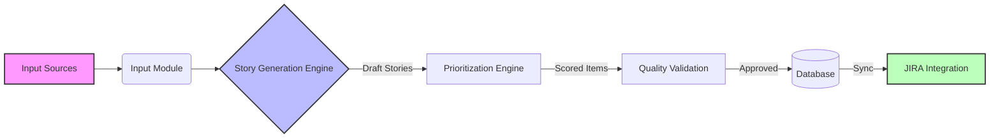

# 🚀 BackLogAI

> **An Intelligent Backlog Generator & Prioritization System**  
> *Transform raw product noise into a structured, prioritized JIRA backlog using AI.*

---

## 🧐 What is BackLogAI?

Product Managers often struggle to balance competing demands from sales, engineering, and users. **BackLogAI** enforces a disciplined approach to backlog creation by filtering every feature request through **Five Key Pillars** using Generative AI. It ensures every story meets quality standards (INVEST) and aligns with strategic business goals before it ever hits your JIRA board.

### The Golden Rule 🏆
Every backlog item generated by this system answers three critical questions:
1.  **Why now?** (Urgency) ⏰
2.  **Why this?** (Value) 💎
3.  **Why us?** (Strategic Fit) 🎯

---

## 🧠 The 5 Pillars Methodology

BackLogAI prioritizes features based on a weighted score across five dimensions:

| Pillar | Focus | Key Question |
| :--- | :--- | :--- |
| **1. User Value** | ❤️ Solving Pain Points | *"Will this feature actually be used and loved?"* |
| **2. Commercial Impact** | 💰 Revenue & Deals | *"Does this help close deals or reduce churn this quarter?"* |
| **3. Strategic Horizon** | 🔭 Future Demand | *"Are we building for the market of 2027, or reacting to 2026?"* |
| **4. Competitive Positioning** | ⚔️ Market Differentiation | *"Is this a catch-up feature or a differentiator?"* |
| **5. Technical Reality** | 🛠️ Feasibility & Debt | *"Is the technical 'price tag' worth the business value?"* |

---

## ⚙️ How It Works

1.  **Input:** Accepts multi-modal inputs (text, ROI data, competitor analysis).
2.  **Process:**
    *   **Generation:** AI drafts stories in standard format (`As a... I want... So that...`) with `Given/When/Then` criteria.
    *   **Scoring:** Auto-calculates RICE, WSJF, and MoSCoW scores based on the 5 Pillars.
    *   **Validation:** Checks stories against **INVEST** criteria (Independent, Negotiable, Valuable, Estimable, Small, Testable).
3.  **Output:**
    *   A clean, ranked backlog.
    *   Direct integration with JIRA (Epics, Stories, Tasks).
    *   **Cross-Platform UI:** Native apps for Android, iOS, Desktop, and Web.

---

## 🏗️ Architecture & Tech Stack

See [ARCHITECTURE.md](./ARCHITECTURE.md) for detailed system design.

*   **Backend:** Python 3.11+, FastAPI, PostgreSQL, OpenAI/Claude API
*   **Frontend:** Kotlin Multiplatform (Android, iOS, Desktop, Web)
*   **DevOps:** Docker, GitHub Actions

## 🗺️ Roadmap

See [IMPLEMENTATION_PLAN.md](./IMPLEMENTATION_PLAN.md) for the phased development plan.

---

## 📄 License

This project is licensed under the MIT License - see the [LICENSE](LICENSE) file for details.
