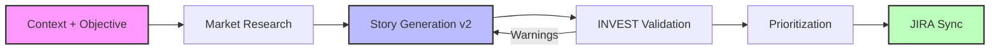

# 🚀 BacklogAI

> **AI Backlog Generator for Product Teams**  
> *Turn product context and objectives into INVEST-ready, JIRA-syncable user stories with AI, market research, and prioritization.*


---

## 🧐 What is BackLogAI?

Product Managers often struggle to balance competing demands from sales, engineering, and users. **BackLogAI** enforces a disciplined approach to backlog creation by combining context-driven inputs, market research, AI drafting, and INVEST validation. It ensures every story aligns with strategic business goals before it ever hits your JIRA board.

### 🔎 Keywords & Tags


### The Golden Rule 🏆
Every backlog item generated by this system answers three critical questions:
1.  **Why now?** (Urgency) ⏰
2.  **Why this?** (Value) 💎
3.  **Why us?** (Strategic Fit) 🎯

---

## 🧠 The 5 Pillars Methodology

BackLogAI prioritizes features based on a weighted score across five dimensions:

| Pillar | Focus | Key Question |
| :--- | :--- | :--- |
| **1. User Value** | ❤️ Solving Pain Points | *"Will this feature actually be used and loved?"* |
| **2. Commercial Impact** | 💰 Revenue & Deals | *"Does this help close deals or reduce churn this quarter?"* |
| **3. Strategic Horizon** | 🔭 Future Demand | *"Are we building for the market of 2027, or reacting to 2026?"* |
| **4. Competitive Positioning** | ⚔️ Market Differentiation | *"Is this a catch-up feature or a differentiator?"* |
| **5. Technical Reality** | 🛠️ Feasibility & Debt | *"Is the technical 'price tag' worth the business value?"* |

---

## ⚙️ How It Works (v2)



1.  **Input:** User provides **context + objective** and optional signals (persona, segment, constraints, metrics, competitors).
2.  **Process:**
    *   **Research:** SerpAPI pulls relevant market and competitor signals (cached + rate-limited).
    *   **Generation:** AI drafts stories (`As a... I want... So that...`) with `Given/When/Then` acceptance criteria.
    *   **Validation:** INVEST checks produce warnings and a quality score, with an optional revision pass.
    *   **Scoring:** Computes priority score + MoSCoW classification.
3.  **Output:**
    *   JIRA-ready description with research summary, NFRs, metrics, risks, and rollout plan.
    *   Direct sync to JIRA.
    *   Cross-platform UI (Android + iOS + macOS) and Slack client channel.

---

## 🔑 Configuration & Setup

To run BackLogAI effectively, you need to configure external services in your `.env` file.

### 1. OpenAI API (Story Generation)
*   **Sign up/Login:** [OpenAI Platform](https://platform.openai.com/)
*   **Create Key:** Go to [API Keys](https://platform.openai.com/api-keys) -> **Create new secret key**.
*   **Set Env:** `OPENAI_API_KEY=sk-...`
*   *Note: If you have issues logging in, try accessing [platform.openai.com](https://platform.openai.com) directly instead of auth subdomains.*

### 2. SerpAPI (Market Research)
*   **Sign up:** [SerpAPI](https://serpapi.com/)
*   **Free tier:** 250 searches/month
*   **Set Env:** `SERPAPI_API_KEY=...`

### 3. JIRA Integration (Sync)
*   **URL:** Your Atlassian domain (e.g., `https://your-domain.atlassian.net`).
*   **Username:** Your Atlassian email address.
*   **API Token:** Go to [Atlassian Security](https://id.atlassian.com/manage-profile/security/api-tokens) -> **Create API token**.
*   **Set Env:**
    ```properties
    JIRA_URL=https://your-domain.atlassian.net
    JIRA_USERNAME=your.email@example.com
    JIRA_API_TOKEN=your_api_token
    JIRA_PROJECT_KEY=KAN
    ```

### 4. Mobile App Integration (Client - Android/ iOS/ macOS/ Windows)
*   **Supported Clients/Channels:** Android, iOS, macOS Desktop, Slack and Windows (Upcoming).
*   **Backend Requirement:** BacklogAI API must be running and reachable from the client platform.
*   **Base URL Guidance + Demo Links:**
    - **Android Emulator:** 📋 `http://10.0.2.2:<backend-port>`  
      Demo: [`demo/android-e2e-v2/`](./demo/android-e2e-v2/)
    - **iOS Simulator:** 📋 `http://localhost:<backend-port>`  
      Demo: [`demo/ios-e2e-v2/`](./demo/ios-e2e-v2/)
    - **macOS Desktop:** 📋 `http://localhost:<backend-port>`  
      Demo: [`demo/macos-e2e-v2/`](./demo/macos-e2e-v2/)
    - **Windows Desktop (Planned):** 📋 `http://<backend-host>:<backend-port>` (same network or public tunnel)
*   **Quick Verification:**
    - Health check: `GET /health`
    - Generation check: `POST /backlog/generate/v2`

### 4.1 Latest Demo Assets (v3)
*   **Android + macOS (combined):**
    - Video: [`demo/e2e-v3/macos-android-demo-v3.mov`](./demo/e2e-v3/macos-android-demo-v3.mov)
    - Screenshot: [`demo/e2e-v3/macos-android-v3.png`](./demo/e2e-v3/macos-android-v3.png)
*   **Slack end-to-end:**
    - Video: [`demo/slack-e2e-v3/slack-backlogai-e2e-demo.mov`](./demo/slack-e2e-v3/slack-backlogai-e2e-demo.mov)
    - Screenshots:
      - [`demo/slack-e2e-v3/slack-backlogai-bot_1.png`](./demo/slack-e2e-v3/slack-backlogai-bot_1.png)
      - [`demo/slack-e2e-v3/slack-backlogai-bot_2.png`](./demo/slack-e2e-v3/slack-backlogai-bot_2.png)
      - [`demo/slack-e2e-v3/slack-backlogai-bot_3.png`](./demo/slack-e2e-v3/slack-backlogai-bot_3.png)

### 4.2 Prebuilt Binaries (v3)
*   **Android APK:** [`demo/binaries-v3/android/BacklogAI-android-release-unsigned.apk`](./demo/binaries-v3/android/BacklogAI-android-release-unsigned.apk)
*   **iPhone IPA:** [`demo/binaries-v3/ios/BacklogAI-iPhone.ipa`](./demo/binaries-v3/ios/BacklogAI-iPhone.ipa)
*   **macOS App Bundle (.zip):** [`demo/binaries-v3/macos/BackLogAI.app.zip`](./demo/binaries-v3/macos/BackLogAI.app.zip)

### 5. Slack Integration (Client Channel)
*   **Integration Model:** Slack works as an additional client channel, allowing users to submit inputs, review Story Preview, and trigger Jira sync directly from Slack.
*   **Business Value:** This reduces context switching and enables backlog collaboration where teams already communicate.
*   **Status:** ✅ End-to-end flow is live and validated.
*   **Deployment Pattern:** Local BacklogAI backend + Local Jira + Live Slack callbacks via Cloudflare Tunnel (quick tunnel for local demos).
*   **Setup Summary:**
    - Create a Slack app with **Slash Commands** + **Interactivity** and scopes `chat:write`, `commands` (optional: `channels:history`, `users:read`).
    - Configure callback endpoints:
      - Slash command: 📋 `https://<public-backlogai-host>/slack/commands`
      - Interactivity: 📋 `https://<public-backlogai-host>/slack/interactions`
    - For local demo: use Cloudflare quick tunnel.
    - For production hardening: add Zero Trust policies and Slack bypass rules for Jira Slack endpoints.
    - Keep Jira linked using the public Jira base URL.
*   **Set Env:** (📋 copy into `.env`)
    ```properties
    SLACK_BOT_TOKEN=xoxb-...
    SLACK_SIGNING_SECRET=...
    SLACK_INTEGRATION_ENABLED=true
    ```
*   **Runtime Flow:** `/backlogai` -> input modal -> Story Preview -> **Sync to JIRA** -> Jira key + URL posted to Slack.
*   **Reliability Notes:**
    - Slash command endpoint returns immediate ACK to avoid Slack timeout/dispatch errors.
    - Sync is idempotent for repeated button clicks and returns existing Jira key/URL.
*   **Security Notes:**
    - Slack request signature verification and timestamp replay protection are enforced on webhook endpoints.
    - Cloudflare Tunnel provides HTTPS callback ingress to local services without opening inbound ports.
*   **Setup Docs:**
    - Live guide: [`SLACK_LIVE_SETUP.md`](./SLACK_LIVE_SETUP.md)
    - Quick tunnel rotation checklist: [`SLACK_QUICK_TUNNEL_CHECKLIST.md`](./SLACK_QUICK_TUNNEL_CHECKLIST.md)

### 5.1 Supported Channels (Current)
| Channel | Create Story Preview | Sync to Jira | Status |
| --- | --- | --- | --- |
| Android App | ✅ | ✅ | Live |
| iOS App | ✅ | ✅ | Live |
| macOS App | ✅ | ✅ | Live |
| Slack (`/backlogai`) | ✅ | ✅ | Live |
| Windows App | 🚧 | 🚧 | Planned |

---

## 🏗️ Architecture & Tech Stack

See [ARCHITECTURE.md](./ARCHITECTURE.md) for detailed system design.

| Layer | Stack |
| --- | --- |
| Backend API | Python 3.11+, FastAPI, Uvicorn |
| AI & Research | OpenAI API, SerpAPI (market search) |
| Backlog Logic | INVEST quality checks, MoSCoW prioritization, story decomposition |
| Integrations | Jira REST API, Slack Web API + interactive webhooks, SMTP-compatible notification workflow |
| Client Apps | Kotlin Multiplatform + Compose (Android, iOS, macOS Desktop, Windows Upcoming) |
| Build & Delivery | Gradle, Docker, GitHub, Cloudflare Tunnel (`cloudflared`) |

## 🗺️ Roadmap

See [IMPLEMENTATION_PLAN.md](./IMPLEMENTATION_PLAN.md) for the phased development plan.

---

## 📄 License

This project is licensed under the MIT License - see the [LICENSE](LICENSE) file for details.
